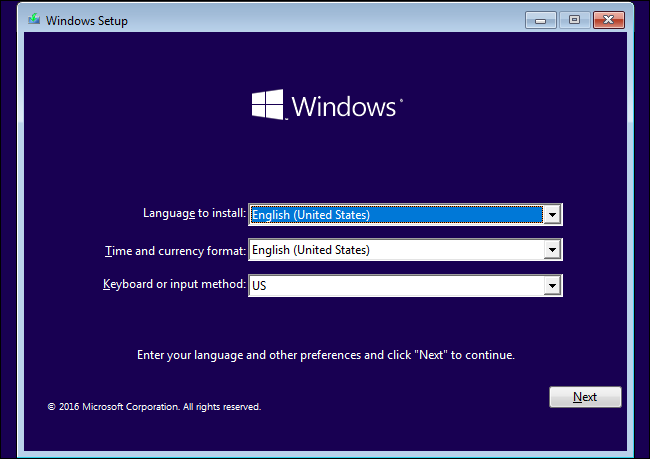
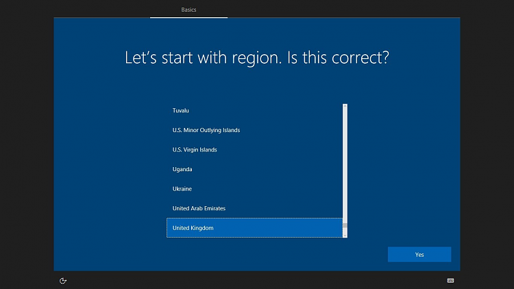

# AutoDucks

A DuckyScript powered Arduino used for automating the boring parts of the processes!

## Requirements

Before we begin to work on the ATTiny85, let's ensure you have everything first. The installations I've provided below are versions I was actively working on. **You aren't required** to utilize these versions and can upgrade your versions as you wish. Though, these were what was working for me.

- Arduino IDE - [`1.8.9`] - ([Install](https://downloads.arduino.cc/arduino-1.8.9-windows.exe))
- Python - [`3.10.0`] - ([Install](https://www.python.org/downloads/))
- Digistump Drivers - ([Install](https://github.com/digistump/DigistumpArduino/releases/download/1.6.7/Digistump.Drivers.zip))

# Setup

Once you've installed the requirements, you can continue setting up your Arduino IDE. [Click here for the official site link walkthrough guide.](http://digistump.com/wiki/digispark/tutorials/connecting#:~:text=In%20the%20Arduino%20application%20go%20to%20the%20%E2%80%9CFile%E2%80%9D%20menu%20and%20select%20%E2%80%9CPreferences%E2%80%9D)

### Troubleshooting setup:

> Error downloading https://raw.githubusercontent.com/digistump/arduino-boards-index/master/package_digistump_index.json

*If you receive this error, please follow steps below:*

1. Disconnect from your current network.
2. Connect to a mobile hotspot or unmonitored network.
3. Quit/Reopen the Arduino IDE

# Testing the Ducky

To ensure your ducky is working as intended, you can test your ducky by flashing it with the code found in `Test_Blink/`.

# Precompiled Scripts

## Understanding the scripts: 

- `/Test_Blink` ~ This is the initial test upload to ensure our duck works.
- `/win10wipe` ~ The Win10 media creation tool wiping assistant.
- `/APenrollerV4` ~ Latest and current Autopilot enrollment script.
- `[DEPRECATED] /APenrollerV1` ~ 1st stage of the Microsoft Autopilot enrollment.
- `[DEPRECATED] /APenrollerV2` ~ 2nd stage of the Microsoft Autopilot enrollment.
- `[DEPRECATED] /APenrollerV3` ~ 1st and 2nd stage of the Microsoft Autopilot enrollment in one.

---

## `/Test_Blink`

### About:

This is the testing payload to verify our duck is working as intended.

### Flashing:

1. Open `/Test_Blink/Test_Blink.ino`
2. Sketch -> Upload (or CTRL + U)
3. Plug in the ducky (when prompted).

### Usage:

1. Plug in the ducky.
2. Enjoy the rapid blinking.

---

## `/win10wipe`

### About:

The Windows 10 media creation tool wiping assistant. This script will automate the process of fresh installing **Windows 10 Pro**. 

### Flashing:

1. Open `/win10wipe/win10wipe.ino`
2. Sketch -> Upload (or CTRL + U)
3. Plug in the ducky (when prompted).

### Usage:

1. Plug in your Windows 10 USB (Media Creation Tool).
2. Boot onto your Win10 (MCT) USB.
3. When you boot onto this screen (below), you can plug in your ducky.



4. When Windows begins to install, your ducky will begin to blink. You can then unplug it.

> NOTE: If your device doesn't have partitions, the ducky may get caught on the partition deletion.

---

## `/APenrollerV4`

### About:

The full script for Autopilot enrollment. (Please make sure you have scorched all of the AAD/MEM records of this device before enrolling it)

### Flashing:

1. Open `/APenrollerV4/APenrollerV4.ino`
2. Sketch -> Upload (or CTRL + U)
3. Plug in the ducky (when prompted).

### Requirements:

- Ethernet *must* be plugged in.
- Device *must* be on screen below:



### Usage:

1. In order to use this duck as intended, you must enable `FN LOCK`. (**Dell**: `FN + ESC` | **HP**: `FN + Caps Lock`)
2. Once FN Lock is enabled, you can plug in the ducky.
3. When the Microsoft login is prompted, you are required to login. (This may prompt twice)
4. Whenever the device is ready, be sure to go in AAD to enable it.

### Current Powershell Script:

```ps
$serial = Get-WmiObject Win32_bios | Select -Expand serialnumber; Rename-Computer REDACTED-$serial;
$env:Path += ";C:\Program Files\WindowsPowerShell\Scripts"
Set-ExecutionPolicy -Scope Process -ExecutionPolicy RemoteSigned
Install-Script -Name Get-WindowsAutoPilotInfo
Get-WindowsAutoPilotInfo -online
```

---

## Upgrading the Firmware

### What you will need:
- Download Required Repository: [micronucleus/micronucleus](https://github.com/micronucleus/micronucleus)

### Walkthrough on firmware upgrade:
1. Open the downloaded repository, `micronucleus`, as well as Command Prompt.
2. Drag `micronucleus.exe` (found in `/commandline/builds/x86_64-mingw32/`) into the command prompt window.
3. Add the `--run` parameter after the path to micronucleus.
4. Drag `upgrade-t85_default.hex` (found in `/firmware/upgrades/`) into the command prompt window.
5. Plug in your ducky.

### Console Output:

```cmd
C:\Users\%username%>C:\Users\%username%\Downloads\micronucleus-2.6\commandline\builds\x86_64-mingw32\micronucleus.exe --run C:\Users\%username%\Downloads\micronucleus-2.6\firmware\upgrades\upgrade-t85_default.hex
> Please plug in the device ...
> Device is found!
connecting: 16% complete
connecting: 22% complete
connecting: 28% complete
connecting: 33% complete
> Device has firmware version 1.6
> Available space for user applications: 6012 bytes
> Suggested sleep time between sending pages: 8ms
> Whole page count: 94  page size: 64
> Erase function sleep duration: 752ms
parsing: 50% complete
> Erasing the memory ...
erasing: 55% complete
erasing: 60% complete
erasing: 65% complete
> Starting to upload ...
writing: 70% complete
writing: 75% complete
writing: 80% complete
> Starting the user app ...
running: 100% complete
>> Micronucleus done. Thank you!
```

*For more support on compiling/selecting your configuration file, you can read more [here](https://github.com/micronucleus/micronucleus#compiling).*

---

## Cautions & Recommendations

### Recommendations:

For the recommendations, you can utilize a USB hub (or USB adapater) to limit the damage caused by a short circuit to the USB hub.

### Cautions:

1. The size of the USB is a choking hazard. Please refrain from eating the USB or letting anything near it that will.
2. The USB does not have short circuit or reverse polarity protection.

*For more information regarding precautions/recommendations, you can read more [here](http://duinokit.com/store/showandtell/topic/62-connecting-and-programming-your-digispark-attiny85-module.html#:~:text=here%3A%C2%A0Digispark%20Basics-,Precautions%3A,-The%20Digispark%2C%20due).*